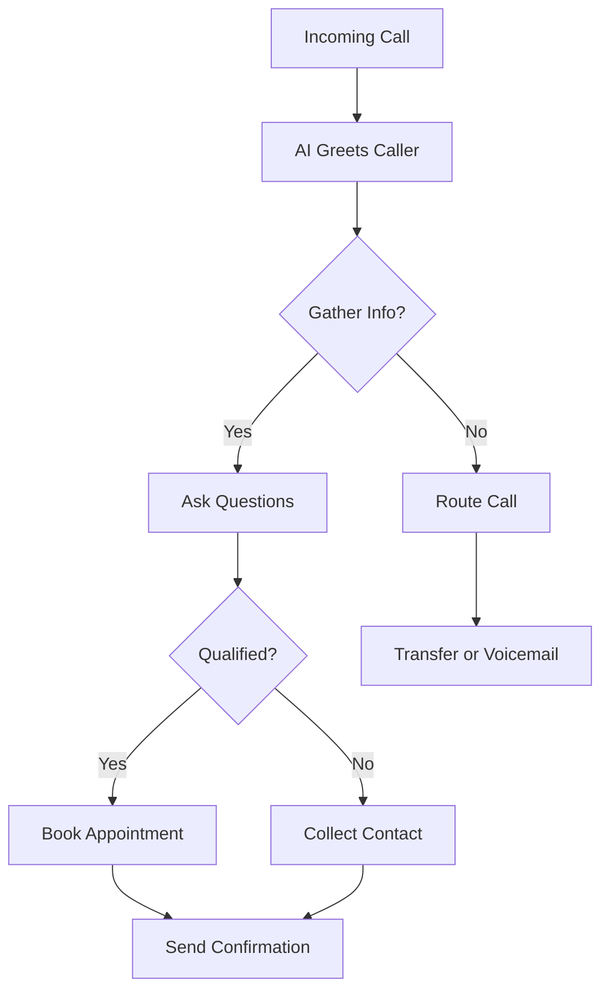

## Overview

Northforge AI receptionists provide 24/7 call answering for contractors. They answer calls instantly, qualify leads based on your criteria, and book appointments directly into your calendar. This reduces missed calls and captures revenue you might otherwise lose.

<Columns cols={3}>
  <Card title="AI Receptionist" icon="phone" href="/docs/receptionist">
    Handles incoming calls with natural conversation.
  </Card>
  <Card title="Lead Qualification" icon="filter" href="/docs/qualification">
    Scores leads using custom questions and logic.
  </Card>
  <Card title="Appointment Booking" icon="calendar" href="/docs/booking">
    Integrates with calendars for seamless scheduling.
  </Card>
</Columns>

## AI Receptionist Functionality

Your AI receptionist greets callers, gathers information, and routes based on intent. It uses natural language processing to understand accents, industry jargon, and urgent requests.

<Callout kind="info">
  Customize greetings and voice in your Northforge Studio dashboard to match your brand.
</Callout>

### Call Handling Flow



## Lead Qualification Process

Qualify leads by defining scoring rules. The AI asks targeted questions, assigns points, and determines next steps.

<Tabs>
  <Tab title="Basic Qualification" icon="check">
    Use simple yes/no questions for quick filtering.

    <Steps>
      <Step title="Define Criteria" icon="edit-3">
        Set questions like "Are you looking for plumbing services?"
      </Step>
      <Step title="Assign Scores" icon="plus">
        Award points: +10 for "Yes", 0 for "No".
      </Step>
      <Step title="Set Threshold" icon="target">
        Route leads scoring `>20` to booking.
      </Step>
    </Steps>
  </Tab>
  <Tab title="Advanced Qualification" icon="settings">
    Integrate custom scripts for complex logic.

    <CodeGroup tabs="JavaScript,Python">
    ```javascript
    function scoreLead(answers) {
      let score = 0;
      if (answers.budget > 5000) score += 15;
      if (answers.urgency === 'immediate') score += 20;
      return score >= 25 ? 'hot' : 'warm';
    }
    ```
    ```python
    def score_lead(answers):
        score = 0
        if answers['budget'] > 5000:
            score += 15
        if answers['urgency'] == 'immediate':
            score += 20
        return 'hot' if score >= 25 else 'warm'
    ```
    </CodeGroup>
  </Tab>
</Tabs>

## Appointment Booking Mechanics

The AI checks your calendar availability in real-time and books slots. Confirmations go via SMS and email.

<Expandable title="Integration Details" default-open="false">
  Connect via webhooks to sync bookings.

  ```javascript
  // Webhook endpoint for new bookings
  app.post('/webhook/northforge', (req, res) => {
    const { customerName, appointmentTime, service } = req.body;
    // Add to your calendar (Google, Outlook, etc.)
    console.log(`Booked: ${customerName} at ${appointmentTime} for ${service}`);
    res.status(200).send('OK');
  });
  ```
</Expandable>

<Callout kind="tip">
  Test workflows in Northforge Studio's simulator before going live.
</Callout>

These concepts form the foundation. Configure them in your dashboard to fit your contracting business.