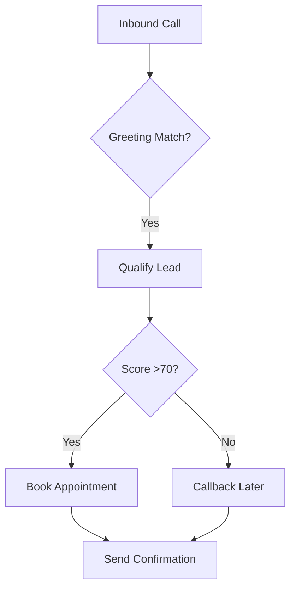

## Overview

Northforge Studio lets you customize your AI receptionists and booking agents to match your contracting business. Adjust greetings, qualification questions, and integrations so your agents handle calls like your team would. Start in the Dashboard under `{Settings > Customization}`.

<Columns cols={3}>
  <Card title="Greetings & Scripts" icon="message-circle" href="/docs/scripts">
    Personalize how agents answer calls and respond to inquiries.
  </Card>
  <Card title="Lead Qualification" icon="filter" href="/docs/qualification">
    Set rules to score and route high-value leads automatically.
  </Card>
  <Card title="Calendar Sync" icon="calendar" href="/docs/integrations">
    Connect to Google Calendar or Outlook for seamless booking.
  </Card>
</Columns>

## Customize Greetings and Scripts

Tailor your agent's opening lines and response scripts to reflect your brand voice. Use the Script Editor to add service-specific details like `{emergency: true}` for urgent plumbing jobs.

<Steps>
  <Step title="Access Script Editor" icon="edit-3">
    Navigate to `{Dashboard > Agents > Your Agent > Scripts}`.
  </Step>
  <Step title="Edit Greeting" icon="message-circle">
    Replace the default with your custom text.
  </Step>
  <Step title="Test Script" icon="play">
    Use the Preview tool to simulate calls.
  </Step>
  <Step title="Deploy Changes" icon="upload">
    Save and activate to apply live.
  </Step>
</Steps>

<Callout kind="tip">
  Include your service area in greetings, like "Serving the greater Seattle area for plumbing emergencies."
</Callout>

Here is a sample greeting script in JSON format:

<CodeGroup tabs="JSON,YAML">
  ```json
  {
    "greeting": "Hello, thanks for calling Northforge Plumbing. This is your AI assistant—how can I help with your plumbing needs today?",
    "services": ["emergency repairs", "installations", "maintenance"],
    "emergency": true
  }
  ```
  ```yaml
  greeting: "Hello, thanks for calling Northforge Plumbing. This is your AI assistant—how can I help with your plumbing needs today?"
  services:
    - emergency repairs
    - installations
    - maintenance
  emergency: true
  ```
</CodeGroup>

## Set Up Qualification Criteria

Define questions and scoring rules to qualify leads. Prioritize callers needing `{emergency: true}` or jobs `{value > $500}`.

<Tabs>
  <Tab title="Basic Rules" icon="check-circle">
    Use these fields to score leads from 0-100.

    | Criterion       | Question Example                  | Score |
    |-----------------|-----------------------------------|-------|
    | Urgency         | "Is this an emergency?"           | 50   |
    | Job Value       | "What's the estimated cost?"      | 30   |
    | Service Needed  | "What service do you need?"       | 20   |

    High scores (`>70`) trigger immediate callbacks.
  </Tab>
  <Tab title="Advanced Scoring" icon="trending-up">
    <ParamField path="urgency" param-type="boolean" required="true">
      Set to `true` for 24/7 priority handling.
    </ParamField>

    <ParamField query="job_value" param-type="number" required="false">
      Minimum `{500}` for qualified leads.
    </ParamField>
  </Tab>
</Tabs>

## Integrate Calendars and Tools

Connect your calendars for real-time booking. Northforge supports Google Calendar, Outlook, and Zapier.

<Expandable title="Supported Integrations" default-open="true">
  - Google Calendar: Sync availability slots.
  - Outlook: Office 365 OAuth flow.
  - Zapier: Connect to CRM like HubSpot.

  Example OAuth config:

  ```json
  {
    "provider": "google",
    "client_id": "YOUR_GOOGLE_CLIENT_ID",
    "redirect_uri": "https://studio.northforge.ai/oauth/callback"
  }
  ```
</Expandable>

<Callout kind="alert">
  Test integrations in sandbox mode first to avoid double-booking.
</Callout>

## Next Steps

Review your customizations in the Analytics dashboard. Monitor call transcripts to refine scripts iteratively. Your setup now captures more leads for your contracting services.

