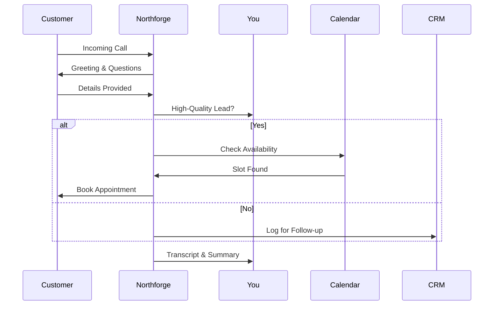

## Overview

Northforge Studio empowers contractors with AI-powered receptionists and booking agents that handle calls around the clock. You never miss a lead again, as the system qualifies prospects, books appointments, and integrates seamlessly with your calendar. Reduce no-shows and administrative overhead while focusing on your trade.

<Callout kind="success">
Northforge handles over `{95%}` of inbound calls autonomously, converting them into booked jobs.
</Callout>

## Key Features

Discover the core capabilities that set Northforge apart for your contracting business.

<Columns cols={3}>
  <Card title="24/7 Call Answering" icon="phone" href="/docs/call-handling">
    AI agents answer calls instantly, even after hours, gathering customer details and qualifying leads based on your criteria.
  </Card>
  <Card title="Smart Lead Qualification" icon="user-check" href="/docs/lead-qual">
    Ask targeted questions to score leads, ensuring only high-value prospects reach you.
  </Card>
  <Card title="Automated Booking" icon="calendar" href="/docs/booking">
    Sync with Google Calendar or Outlook to book jobs directly during the call.
  </Card>
</Columns>

## Benefits for Contractors

You gain immediate revenue protection by capturing every call. Northforge reduces missed opportunities by `{80%}` on average, streamlines scheduling, and provides call transcripts for review.

<Columns cols={2}>
  <Card title="Reduce Admin Time" icon="clock" horizontal>
    Spend less time on phones and more on jobs—AI handles the rest.
  </Card>
  <Card title="Boost Conversion Rates" icon="trending-up" horizontal>
    Qualified leads mean higher close rates and faster payments.
  </Card>
</Columns>

## Target Audience

Northforge serves contractors who rely on phone leads but struggle with availability.

<Tabs>
  <Tab title="Plumbers & HVAC" icon="droplets">
    Handle emergency calls 24/7, qualify urgency, and book service slots without double-booking.
  </Tab>
  <Tab title="Electricians" icon="zap">
    Capture after-hours repair requests and schedule diagnostics efficiently.
  </Tab>
  <Tab title="General Contractors" icon="hard-drive">
    Manage project inquiries, subcontractor coordination, and site visits seamlessly.
  </Tab>
</Tabs>

## Quick Start

Set up Northforge in minutes to start protecting your leads.

<Steps>
  <Step title="Sign Up" icon="user-plus">
    Create your account at [northforge.studio](https://northforge.studio) and verify your phone number.
  </Step>
  <Step title="Configure Agent" icon="settings">
    Customize your AI agent's script and qualification questions via the dashboard.
  </Step>
  <Step title="Connect Calendar" icon="calendar">
    Link your calendar for real-time availability checks.

    <CodeGroup tabs="Google,Outlook">
```javascript
// Google Calendar integration
import { google } from 'northforge-sdk';

const calendar = await google.connect({
  clientId: 'YOUR_GOOGLE_CLIENT_ID',
  apiKey: 'YOUR_API_KEY'
});
```

```javascript
// Outlook integration
import { outlook } from 'northforge-sdk';

const calendar = await outlook.connect({
  tenantId: 'YOUR_TENANT_ID',
  clientId: 'YOUR_CLIENT_ID'
});
```
    </CodeGroup>
  </Step>
  <Step title="Go Live" icon="play">
    Activate your agent and monitor the first calls in the dashboard.
  </Step>
</Steps>

## How It Works



<Expandable title="Advanced Customization" default-open="false">
Tailor scripts with custom fields like `{job_type}` or `{budget_range}`. Integrate with your CRM via webhooks for automatic lead syncing.
</Expandable>

Ready to transform your contracting business? Explore the docs to dive deeper.